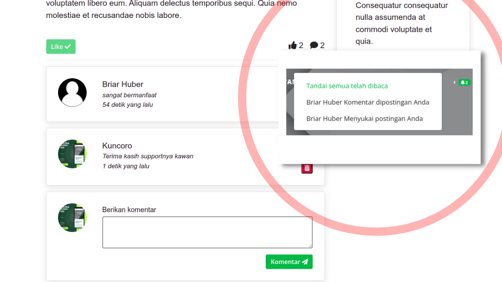
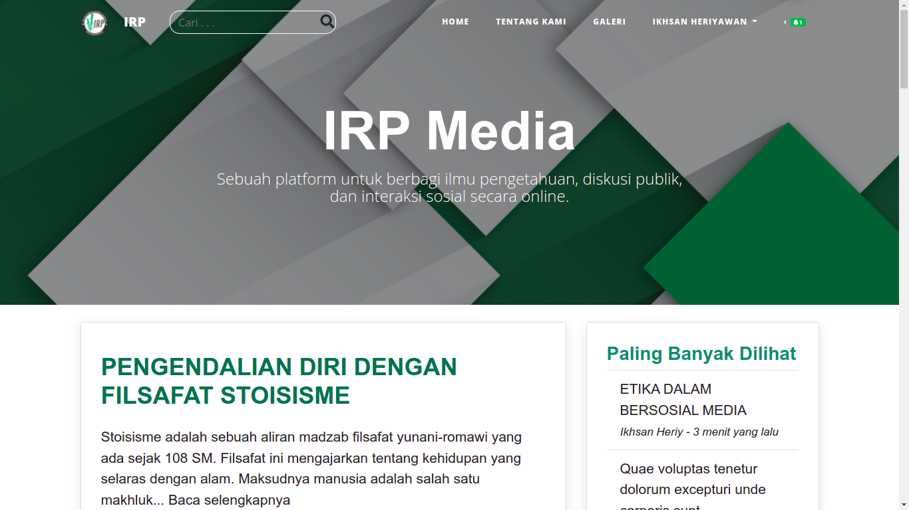
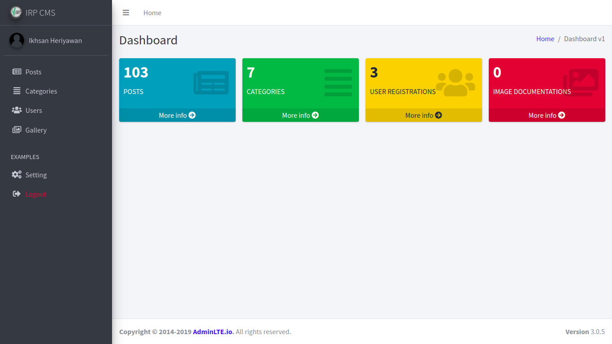
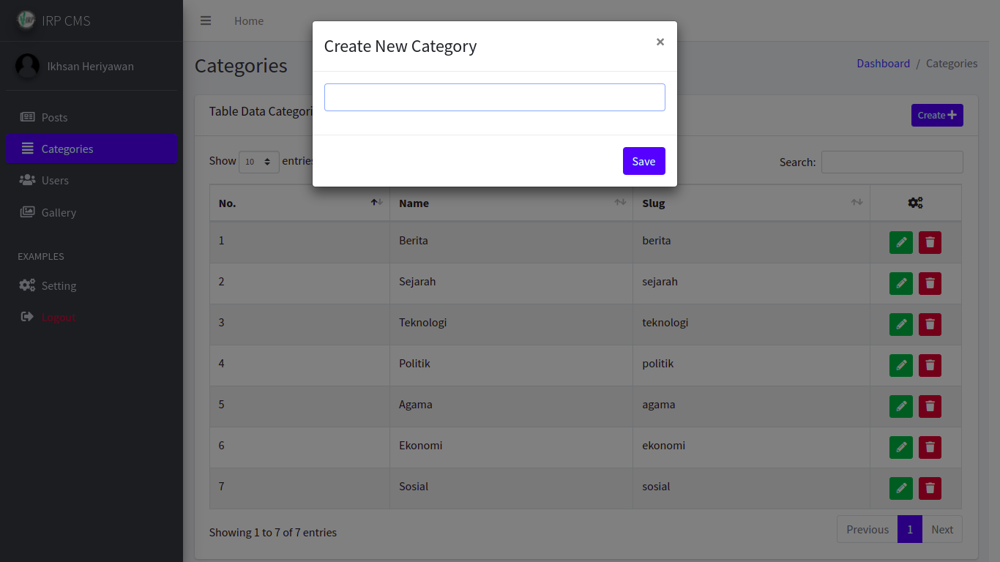

# Simple CMS Blog

Simple CMS Blog that can like or comment every posts and then can get notifications when posts from a user has been liked or commented

## Visuals





## Installation

```bash
composer install
cp .env.example .env
php artisan key:generate
php artisan storage:link
php artisan migrate:fresh --seed
```

## Configuration

add this line in your .env file
```php
FILESYSTEM_DRIVER=public
```
### Users
- Admin
- Email : admin@gmail.com
- Password : admin
- User
- Email : user@gmail.com
- Password : admin

### important
if you want to add feature default avatar image for users you can follow these steps
- login to user has registered via seeder
- edit user image
- put your image default in directory /storage/app/public/img/profiles/
- and get name 'irp-logo.png'

You can see details in my youtube video https://www.youtube.com/watch?v=S-xPWSIBIhY&t=4s

## Contributing
Pull requests are welcome. For major changes, please open an issue first to discuss what you would like to change.

Please make sure to update tests as appropriate.

## License
[MIT](https://choosealicense.com/licenses/mit/)
